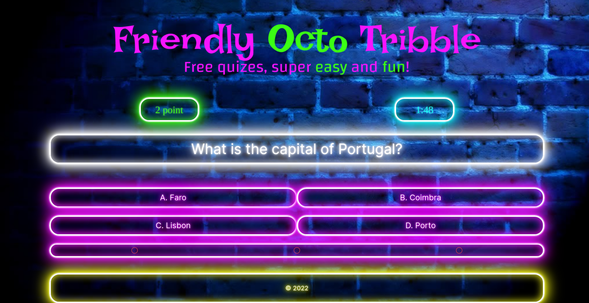

# Dokumentacja aplikacji “Friendly Octo Tribble”

# Twórcy projektu

- [Szymon Hryszko](https://github.com/Shirobachi)
- [Łukasz Fida](https://github.com/Fidek-creator/)
- [Przemysław Banaś](https://github.com/fisurek)

# Cel projektu

Celem projektu było stworzenie dla klienta aplikacji quizowej do baru/klubu, która przy pomocy projektora będzie wyświetlać pytania z przeglądarki na które z kolei będą odpowiadać drużyny złożone z 2 lub więcej osób.

# Wykorzystane technologie

**Wykorzystane technologie:**

- framework Ruby on rails
- tailwind CSS
- backend hostowany przez heroku

# Wymagania

## Wymagania funkcjonalne

- możliwość zrobienia nowej gry
- możliwość rozpoczęcia gry
- możliwość edycji gry (zmiana nazwy, pytań, drużyn)
- możliwość wyświetlenia uzasadnienia  oraz linku prowadzącego do strony z uzasadnieniem poprawnej odpowiedzi)
- możliwość włączenia przerwy po dowolnym pytaniu
- możliwość wyświetlenia poprawnej odpowiedzi wraz z ilością drużyn, które na nie odpowiedziały
- możliwość wyświetlania rankingu z ostatnich 10 gier 10 najlepszych drużyn
- możliwość przelosowania danego pytania
- mozliwosc wyświetlenia nast. pytania
- możliwość dodania nowego pytania (pytanie (text + [url]), 4x odp [text] + [url], [uzasadnienie ([text] + [img] + [url source])] + (ilość pkt + czas))
- możliwość zarządzania pulą pytań
- możliwość wyświetlenia pytania (odpowiedzi będą się wyświetlać w losowej kolejność)
- możliwość edycji pytania (zmiana treści, usunięcie)
- możliwość wyświetlenia licznika do pytania
- możliwość dodania nowej drużyny
- możliwość edycji drużyny (zmiana nazwy, zdjęcia, ilości członków)
- możliwość wyświetlenia zasad
- możliwość edycji zasad (treść, numer)
- możliwość zmiany języka (Polski, Angielski)
- możliwość zalogowania się do panelu
- możliwość zarządzania rankingiem wylosowanie pytan (ze względu na ilość pytań za daną ilość punktów)
- mozliwosc przypisania druzynom odpowiedzi (ich wyborów)
- zmiana algorytmu przeliczania ilosci punktow z czasu pytania i vice versa

## Wymagania niefunkcjonalne

- MySQL
- konto na heroku
- Strony CF
- do obsługi działań nie zaleca się przybliżania strony
- Wymagany projektor
- wersja przeglądarki Chrome >= v.90.x
- z aplikacji może korzystać do 3 użytkowników na raz
- aplikacja nie jest monitorowana
- aplikacja nie przechowuje informacji objętych przepisami RODO

# Diagram przypadków użycia

# Baza danych (schemat ERD)

# Interfejs

Wygląd menu administratora

Gra podczas pytania

.png)

Gra podczas przerwy

.png)

Gra po zakonczeniu pytania
